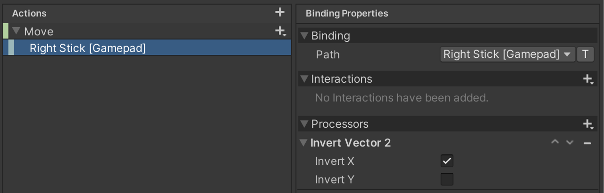
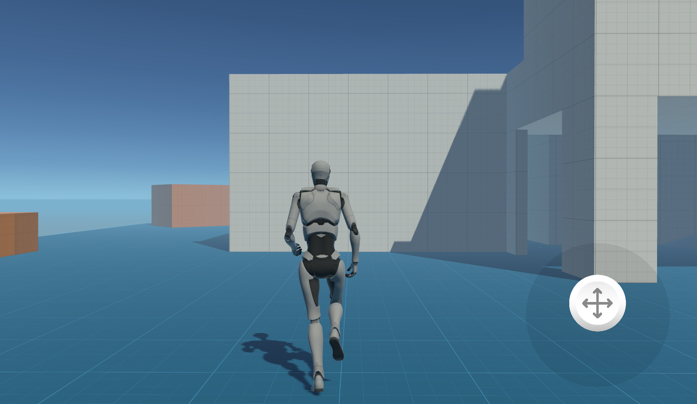
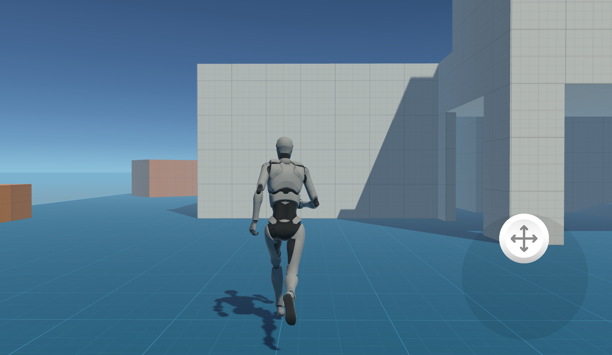
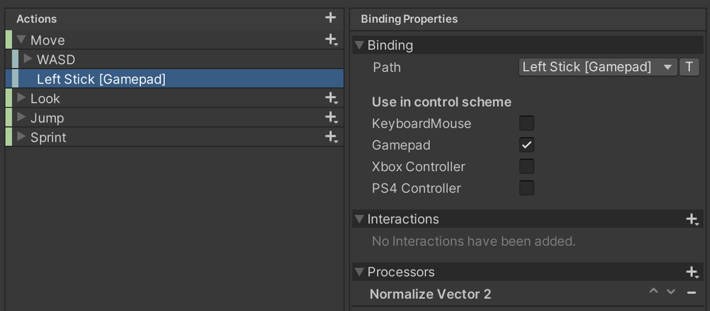
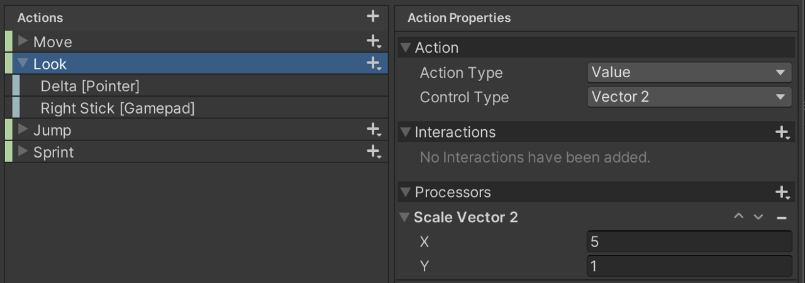
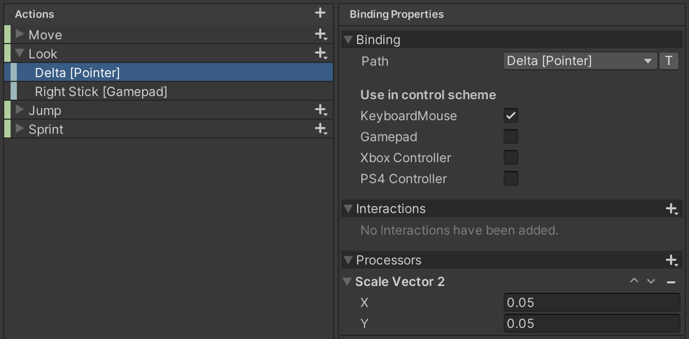
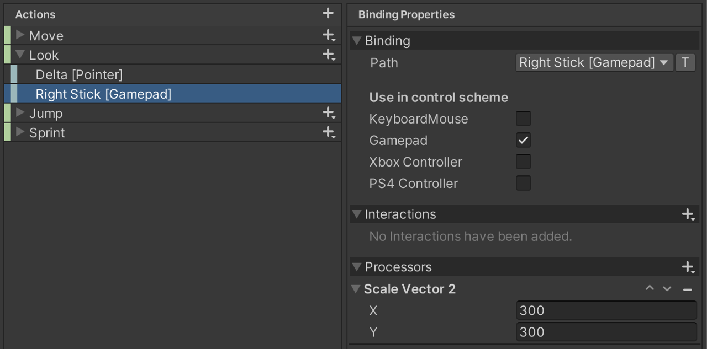
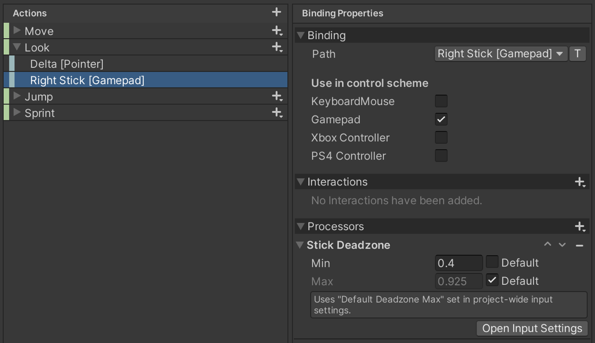
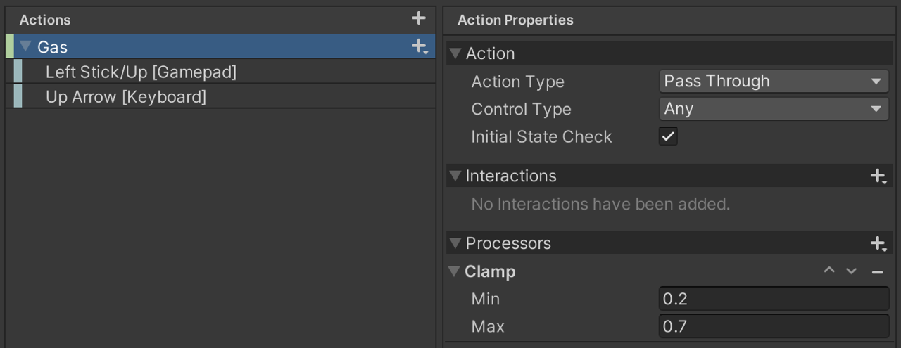

# Processors

An Input Processor takes a value and returns a processed result for it. The received value and result value must be of the same type. For example, you can use a [clamp](#clamp) Processor to clamp values from a control to a certain range.

> [!NOTE]
> To convert received input values into different types, refer to [composite Bindings](xref:input-system-action-bindings#composite-bindings).

## Using Processors

You can install Processors on [bindings](xref:input-system-action-bindings), [actions](xref:input-system-actions) or on [controls](xref:input-system-controls). Refer to [How to apply Processors](xref:input-system-processors) to learn more.

Each Processor is [registered](xref:UnityEngine.InputSystem.InputSystem.RegisterProcessor``1(System.String)) using a unique name. To replace an existing one, register your own under an existing name.

Processors can have parameters which can be booleans, integers, or floating-point numbers. When created in data such as [bindings](xref:input-system-action-bindings), processors are described as strings that look like function calls:

```CSharp
    // This references the processor registered as "scale" and sets its "factor"
    // parameter (a floating-point value) to a value of 2.5.
    "scale(factor=2.5)"

    // Multiple processors can be chained together. They are processed
    // from left to right.
    // Example: First invert the value, then normalize [0..10] values to [0..1].
    "invert,normalize(min=0,max=10)"
```

## Choose the right Processor

The following sections contain a brief explanation and various example scenarios for the different Processor types. Note that there are additional cases where Processors may apply; the scenarios described here illustrate only some of them. In some situations, it might be useful to combine multiple Processors to achieve a specific goal.
Refer to the [Processor Types](ProcessorTypes.md) for a comprehensive list and information on how to write your own custom Processors.

### Invert

The [Invert Processor](ProcessorTypes.md#invert) inverts input values of any type (e.g. float, Vector2, or Vector3) by multiplying them by -1. This results in effects such as reversing player navigation, for example, the left arrow would be interpreted as a right arrow, and vice versa.

#### Example: Ship navigation

To use an axis control to mimic a ship's rudder, inverting the input produces the desired effect. Pulling left steers the ship right, and vice versa.


You can achieve this by using an Invert Processor on the Action or the Binding. In this scenario, the Processor is applied to the Binding. Note that inversion is enabled for the X axis but not for the Y axis. Inverting the Y axis would cause the ship to move backward when the joystick is pulled upward. The following image shows the setup in the Action Asset Editor.



Finally, attach the following script to a GameObject with a PlayerInput component that references the corresponding Action Asset:

```csharp
using UnityEngine;
using UnityEngine.InputSystem;

public class Boat : MonoBehaviour
{
    void OnMove(InputValue value)
    {
        // The X value will be used to rotate the boat
        var stick = value.Get<Vector2>();
        var direction = stick.x;
        transform.Rotate(Vector3.up, direction);
        // To move the boat forwards, this code block uses the Y value of the stick
        var speed = stick.y;
        transform.Translate(new Vector3(0,0,speed),Space.Self);
    }
}
```

### Normalize

The [Normalize Processors](ProcessorTypes.md#normalize) normalizes the magnitude of the input vector so that it always has a length of 1. This extracts the direction of the input while removing additional information that may not be needed.
In the case of float input values, the values are normalized between a defined minimum, zero, and maximum.
Normalized input is particularly useful in scenarios where the specific magnitude of an input might distort the consistency of an intended action.

#### Example: A steady running player

To ensure the player always moves at a constant speed where the input simply triggers the action and controls the direction, the Normalize Processor is a suitable choice. This is achieved by retrieving the input vector while ignoring its magnitude and focusing solely on its direction.




In the images shown above, the player moves forward at a constant speed, regardless of how far the joystick is pushed upward.

To apply the Processor, add it to the Binding, as shown in the image below.



> [!NOTE]
> This scenario uses the [Starter Assets](https://assetstore.unity.com/packages/essentials/starter-assets-thirdperson-updates-in-new-charactercontroller-pa-196526?srsltid=AfmBOoqLWdW2pU5Wt2reGYdWVodc1e0ko3cBKtfMQuPSgVqmL7yVA3dB), and the included PlayerScript is utilized to move the player.

### Scale

The [Scale Processor](ProcessorTypes.md#scale) multiplies the input value by a given factor X. This applies to float values as well as vectors, where each axis is multiplied by the corresponding factor specified for that axis.
This allows you to assign weight to input values, which can, for example, make a particular type of control easier to use.

#### Example: Horizontally aligned Camera

To make the look-around movement smoother and improve ease of use, it may be helpful to reduce the vertical rotation and scale the input values for horizontal rotation. For in-game landscapes that are primarily horizontally aligned, this is a useful feature to prevent the camera from rotating vertically too quickly or in unintended ways.
To apply this effect to all bindings, you can add the Processor to the Action itself (Look in this scenario). The following image shows the setup using the Starter Assets example:



There are two Bindings attached to the Action. The input value ranges of the two bindings are very different. To mitigate this difference, it helps to use a Scale Processor on each of the Bindings. See how the Scale Processor normalizes the input data values for a joystick and a pointer (e.g., a mouse) in the images below.




> [!NOTE]
> This scenario uses the [Starter Assets](https://assetstore.unity.com/packages/essentials/starter-assets-thirdperson-updates-in-new-charactercontroller-pa-196526?srsltid=AfmBOoqLWdW2pU5Wt2reGYdWVodc1e0ko3cBKtfMQuPSgVqmL7yVA3dB), and the included PlayerScript is utilized to rotate the camera.

#### Example: Custom mouse sensitivity

You can use a Scale processor to adjust mouse sensitivity through a game settings menu. To support custom X and Y speed settings, apply the processor to a Binding limited to a Pointer device.

### Deadzone

To filter noise from controls that are rarely in a default state, constantly send input values, or seldom report the maximum value, a [Deadzone Processor](ProcessorTypes.md#axis-deadzone) might be the right choice.
The specified minimum value can filter out small movements or noise from the control, while the maximum value can mitigate the difference between the control's maximum value and the reported maximum values.

#### Example: Accessibility enhancement

You may want to use the Deadzone Processor to improve accessibility for physically challenging input gestures, such as very small movements on an input device. The sensitivity can be configurable through a game menu, for example. To filter out input events from tiny movements on a joystick (e.g., for trembling hands), here’s how you can modify the right stick binding of a gamepad to ignore input events for small input values:



The default minimum value is overridden to allow a higher threshold for minimum input values. For the maximum value, the default is used to standardize the values across all gamepads (since not all gamepads may ever send the maximum value).

> [!NOTE]
> This scenario uses the [Starter Assets](https://assetstore.unity.com/packages/essentials/starter-assets-thirdperson-updates-in-new-charactercontroller-pa-196526?srsltid=AfmBOoqLWdW2pU5Wt2reGYdWVodc1e0ko3cBKtfMQuPSgVqmL7yVA3dB), and the included PlayerScript is utilized to rotate the camera.

### Clamp

The [Clamp Processor](ProcessorTypes.md#clamp) clamps the input value to a specified range. The minimum value of the Processor defines the lowest input value that will be accepted, while the value cannot exceed the given maximum value. In combination with the Scale Processor, it is easy to standardize the input value ranges of different devices and place them within a well-defined value spectrum.

#### Example: Racing game speed control

In a case where the player is not supposed to fall below a certain base speed, but also cannot exceed a certain maximum speed, the Clamp Processor is the one you may want to use.
In the following image, you can see how a Clamp Processor can be used to restrict input values within a defined minimum and maximum range.



> [!NOTE]
> The Bindings can contain input values with very different ranges. In that case, a Scale Processor on the Bindings can help preprocess the values before clamping them (Processors on Actions are applied after Processors on Bindings).
